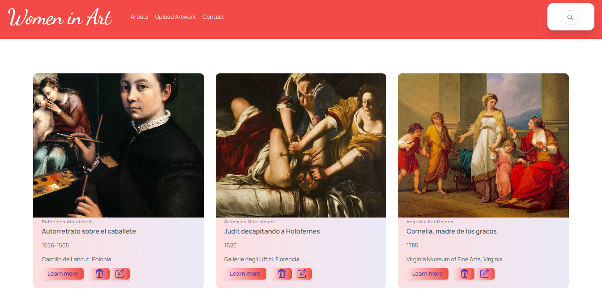
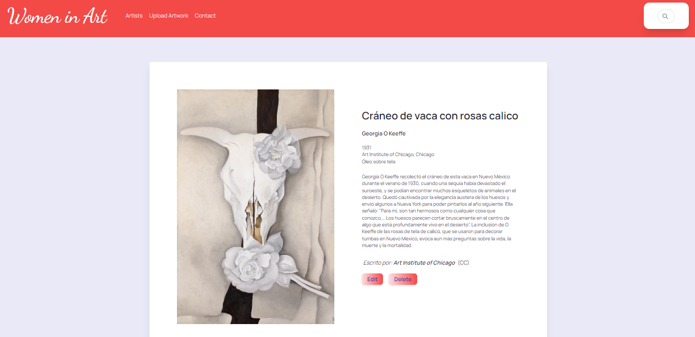

<div align="center">

  
  
  <p>
  </p>
  
  </div>

<br />

<!-- Table of Contents -->
# 💻 Table of Contents

- [About the Project](#star2-about-the-project)
  * [Screenshots](#camera-screenshots)
  * [Tech Stack](#space_invader-tech-stack)
  * [Features](#dart-features)
  * [Color Reference](#art-color-reference)
- [Getting Started](#toolbox-getting-started)
  * [Installation](#gear-installation)
  * [Run Locally](#running-run-locally)
- [Author](#wave-contributing)
- [Contact](#contact)

  

<!-- About the Project -->
## ⭐ About the Project
Esta idea surge a partir de mi interés por la historia del arte, y principalmente por visualizar el trabajo de artistas mujeres, que a pesar de todas las trabas y contratiempos que tuvieron para llegar a serlo, lo han logrado.
Mi intención es que cuando se piense en arte no sólo aparezcan en nuestra mente Picasso o Van Gogh sino también éstas increibles artistas que fueron "borradas" de los libros.


<!-- Screenshots -->
### 📷 Screenshots

<div align="center"> 
  
  <br>
  
</div>


<!-- TechStack -->
### 👾 Tech Stack

- PHP
- MySQL
- Tailwind

<!-- Features -->
### 🎯 Features

- Create
- Read
- Update
- Delete
- Search Bar

<!-- Color Reference -->
### 🎨 Color Reference

| Hex             |                                
| ----------------- |
|  #f34a47 |
|  #fddfe1 |
|  #3829a6 |
| #eae9f7 |


<!-- Getting Started -->
## 	🧰 Getting Started

<!-- Installation -->
### ⚙️ Installation

Crea una carpeta en tu directorio xampp/htdocs, donde clonarás el repositorio.
En XAMPP inicia Apache y MySQL


<!-- Run Locally -->
### 🏃‍♀️ Run Locally

Clona el proyecto

```bash
  git clone https://github.com/mflamanna/Women-in-Art.git
```

Situate en el directorio del proyecto

```bash
  cd Women-in-Art
```

En el navegador coloca:

```bash
  http://localhost/Women-in-Art/
```

<!-- Contributing -->
## 👋 Contributing

Contributions are always welcome!

See Contact for ways to get started.


<!-- Contact -->
## 🤝 Contact

Florencia Lamanna - lamanna.mflorencia@gmail.com

Project Link: [https://github.com/mflamanna/Women-in-Art.git]

